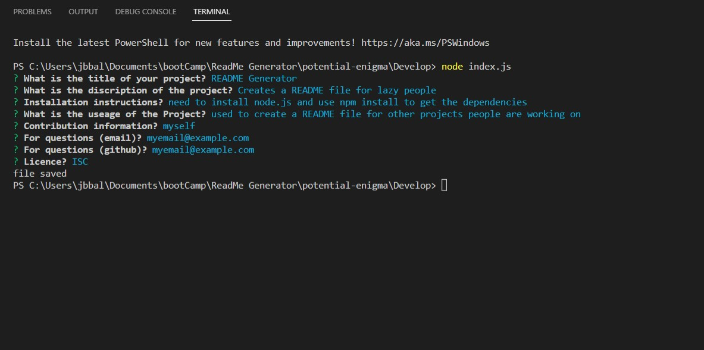
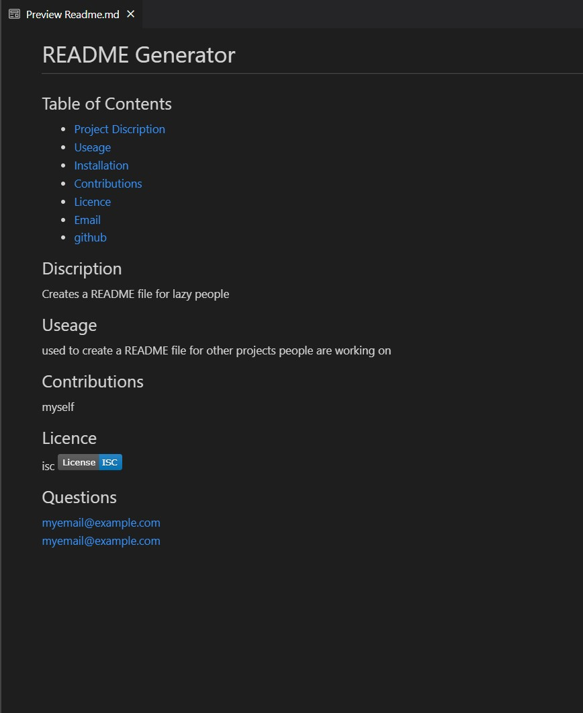

# Apeman's README Generator 
## For the lazy gorilla in all of us
### Table of Contents
- [Project Discription](#Discription)
- [Useage](#Useage)
- [Installation](#Installation)
- [Contributions](#Constributions)
- [Licence](#Licence)
- [Email](#Questions)
- [github](#Questions)

## Discription
This program prompts the user to fill in some questions about their project on the command line and uses this information to create a README file.

## Useage 
This program is intended to be used by only the laziest of people to create a README file with very little effort. Tos use the program the user only has to input the command "node index.js" into the intergrated terminal and the program will begin.

## Installation
The program is simple to install just go to the intergrated terminal and type the command "npm init -y" and then "npm install" to install the dependences.
This program also requires node.

## Contributions 
The main contributer for this program is myself and the Birmingham university for suppling the starter code. Sources such as gist.github for the licence badge links and stack overflow for the information they provied.

## Licence 
Not completely sure I need one for this but the following should be good enough.

## Questions 
For any further questions that are not addresed in  this README please find my email and github below

### email: jbbalshaw@gmail.com
### github: https://github.com/JosephBalshaw/Apeman-s-README-Generator/blob/main/README.md 

## ScreenShots

### CommandLine

### README

